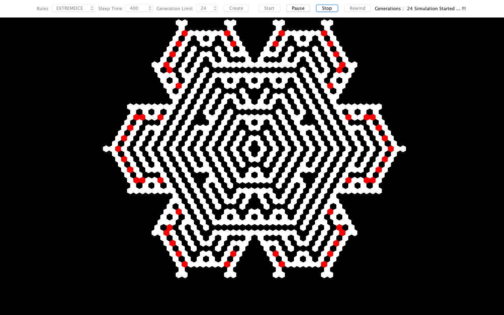

## Snowflake-Crystal-Growth

## Output: 

## Features:
1. Select any rule to generate a crystal.
2. Select the wait time between generations.
3. Select the size(generations) to which your crystal should grow.
4. U can Start, Stop, pause and rewind the project.

## Technologies:
1. Java
2. Object-oriented Programming
3. AWT/Swings

## Usage:
If you want to run the project, download the jar file HarshitMandada.jar and open it. 
The instructions are documented and most of them are self explanatory.
Make sure your machine is configured to run Java Applications.

## License
[MIT License](https://opensource.org/licenses/MIT)

## Want to contribute?

1. Got an amazing idea to make the plugin better?
2. Found an annoying bug?

Please don't hesitate to raise an issue through GitHub or open a pull request to show off your fancy pants coding skills - we'll really appreciate it!

## Key Contributors
@harshitmandada1
